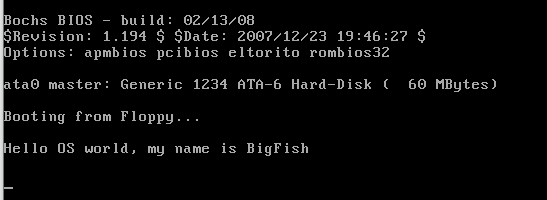

# 实验步骤

## 启动界面

> 改写 bootsect.s 主要完成如下功能：  
bootsect.s 能在屏幕上打印一段提示信息“XXX is booting...”，其中 XXX 是你给自己的操作系统起的名字，例如 LZJos、Sunix 等（可以上论坛上秀秀谁的 OS 名字最帅，也可以显示一个特色 logo，以表示自己操作系统的与众不同。）

- `/oslab/linux-0.11/boot` 编写 mybootsect.s
- 编译

  ```bash
  as86 -0 -a -o bootsect.o mybootsect.s
  ld86 -0 -s -o bootsect bootsect.o
  dd bs=1 if=bootsect of=Image skip=32
  # 将刚刚生成的 Image 复制到 linux-0.11 目录下
  $ cp ./Image ../Image
  $
  # 执行 oslab 目录中的 run 脚本
  $ ../../run
  $
  ```
  

